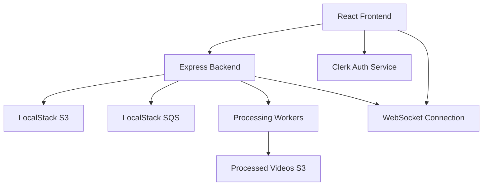

# Design Document

## Overview

The TranscodeX is a modern React-based web application that provides comprehensive video management capabilities. Built with a clean, Vimeo-inspired interface, it integrates Clerk authentication, real-time processing status tracking, and seamless video embedding functionality. The platform uses presigned URLs for secure uploads and maintains real-time communication for processing status updates.

## Architecture

### High-Level Architecture



### Component Architecture

The frontend follows a modular component architecture:

- **Layout Components**: Header, Navigation, Sidebar
- **Authentication Components**: LoginModal, AuthGuard
- **Video Components**: VideoList, VideoCard, UploadModal, EmbedModal
- **Status Components**: StatusPage, LogViewer, ProgressBar
- **Shared Components**: Modal, Button, LoadingSpinner

### State Management

The application uses React Context API for global state management:
- **AuthContext**: User authentication state and Clerk integration
- **VideoContext**: Video list, upload status, and processing states
- **UIContext**: Modal states, notifications, and loading indicators

## Components and Interfaces

### Frontend Components

#### Core Layout Components

**Header Component**
```typescript
interface HeaderProps {
  user: User | null;
  onLoginClick: () => void;
  onLogoutClick: () => void;
}
```

**Navigation Component**
```typescript
interface NavigationProps {
  currentPath: string;
  isAuthenticated: boolean;
}
```

#### Video Management Components

**VideoList Component**
```typescript
interface VideoListProps {
  videos: Video[];
  loading: boolean;
  onVideoSelect: (videoId: string) => void;
  onEmbedClick: (videoId: string) => void;
}
```

**UploadModal Component**
```typescript
interface UploadModalProps {
  isOpen: boolean;
  onClose: () => void;
  onUploadComplete: (videoId: string) => void;
}
```

**StatusPage Component**
```typescript
interface StatusPageProps {
  videoId: string;
  processingStatus: ProcessingStatus;
  logs: ProcessingLog[];
}
```

#### Authentication Components

**AuthGuard Component**
```typescript
interface AuthGuardProps {
  children: React.ReactNode;
  fallback?: React.ReactNode;
}
```

### Backend API Interfaces

**Video Upload Endpoint**
```typescript
interface UploadRequest {
  filename: string;
  contentType: string;
  fileSize: number;
}

interface UploadResponse {
  presignedUrl: string;
  videoId: string;
  uploadId: string;
}
```

**Video Processing Status**
```typescript
interface ProcessingStatus {
  videoId: string;
  status: 'pending' | 'processing' | 'completed' | 'failed';
  progress: number;
  currentStage: string;
  logs: ProcessingLog[];
  createdAt: Date;
  updatedAt: Date;
}
```

**Embed Script Generation**
```typescript
interface EmbedRequest {
  videoId: string;
  width?: number;
  height?: number;
  autoplay?: boolean;
}

interface EmbedResponse {
  embedScript: string;
  previewUrl: string;
}
```

## Data Models

### User Model
```typescript
interface User {
  id: string;
  clerkId: string;
  email: string;
  firstName?: string;
  lastName?: string;
  createdAt: Date;
  updatedAt: Date;
}
```

### Video Model
```typescript
interface Video {
  id: string;
  userId: string;
  title: string;
  description?: string;
  filename: string;
  originalUrl: string;
  processedUrls: {
    [resolution: string]: string;
  };
  thumbnailUrl?: string;
  duration?: number;
  fileSize: number;
  status: VideoStatus;
  uploadedAt: Date;
  processedAt?: Date;
}

type VideoStatus = 'uploading' | 'pending' | 'processing' | 'completed' | 'failed';
```

### Processing Log Model
```typescript
interface ProcessingLog {
  id: string;
  videoId: string;
  level: 'info' | 'warn' | 'error';
  message: string;
  timestamp: Date;
  stage: string;
}
```

## Correctness Properties

*A property is a characteristic or behavior that should hold true across all valid executions of a system-essentially, a formal statement about what the system should do. Properties serve as the bridge between human-readable specifications and machine-verifiable correctness guarantees.*

### Property Reflection

After reviewing all testable properties from the prework analysis, I've identified several areas where properties can be consolidated or where redundancy exists:

**Consolidation Opportunities:**
- Authentication flow properties (2.2, 2.3, 4.1, 4.3) can be combined into comprehensive authentication behavior properties
- Upload flow properties (5.3, 5.4, 7.1) represent a single upload-to-status workflow that can be unified
- Status page update properties (7.3, 7.4, 8.5) all test real-time status propagation and can be combined
- File validation and error handling properties (5.2, 5.5) can be merged into comprehensive upload validation

**Unique Value Properties:**
- Responsive layout testing (1.4) provides unique device compatibility validation
- Worker container limits (8.3) provides unique resource management validation
- Embed script generation and CORS (6.1, 6.4) provide unique embedding functionality validation
- Video list display and pagination (3.1, 3.2, 3.3) provide unique content management validation

Based on this analysis, the following properties provide comprehensive coverage without redundancy:

Property 1: Authentication flow completeness
*For any* user authentication state and protected resource access, the system should properly redirect unauthenticated users to login and return them to their intended destination after successful authentication
**Validates: Requirements 2.2, 2.3, 4.1, 4.3**

Property 2: Responsive layout adaptation
*For any* screen size and device type, the platform should display an appropriately adapted layout that maintains functionality across different viewport dimensions
**Validates: Requirements 1.4**

Property 3: Video list content and pagination
*For any* authenticated user with uploaded videos, the video list should display all required video information and implement pagination when the video count exceeds performance thresholds
**Validates: Requirements 3.1, 3.2, 3.3**

Property 4: Upload validation and error handling
*For any* file upload attempt, the system should validate file types and sizes, display appropriate error messages for invalid files, and provide retry options for failed uploads
**Validates: Requirements 5.2, 5.5**

Property 5: Upload to status page workflow
*For any* successful video upload, the system should use presigned URLs for S3 upload, close the upload modal, and redirect to the status page showing processing progress
**Validates: Requirements 5.3, 5.4, 7.1**

Property 6: Real-time status propagation
*For any* video processing status change, the system should update the database, notify connected clients through real-time connections, and update the status page UI with current progress and timestamps
**Validates: Requirements 7.3, 7.4, 8.5**

Property 7: Worker container resource limits
*For any* video processing workload, the system should respect the maximum limit of 5 concurrent worker containers and properly queue additional processing requests
**Validates: Requirements 8.3**

Property 8: Embed script generation and CORS
*For any* video embed request, the system should generate a video-specific embed script and ensure proper CORS configuration for cross-origin embedding functionality
**Validates: Requirements 6.1, 6.4**

Property 9: Processing pipeline event flow
*For any* video uploaded to S3, the system should trigger SQS messages, spawn appropriate worker containers, and upload transcoded results to the processed videos bucket
**Validates: Requirements 8.2, 8.4**

## Error Handling

### Frontend Error Handling

**Authentication Errors**
- Clerk authentication failures should display user-friendly error messages
- Session expiration should trigger automatic re-authentication prompts
- Network connectivity issues should show retry options

**Upload Errors**
- File validation errors should prevent upload and show specific validation messages
- Network upload failures should provide retry functionality with exponential backoff
- S3 upload errors should be caught and displayed with actionable guidance

**Video Processing Errors**
- Processing failures should be displayed on the status page with error details
- Worker container failures should trigger automatic retries with limits
- Transcoding errors should provide specific error codes and resolution steps

### Backend Error Handling

**API Error Responses**
```typescript
interface ErrorResponse {
  error: {
    code: string;
    message: string;
    details?: any;
  };
  timestamp: Date;
  requestId: string;
}
```

**Processing Error Recovery**
- Failed worker containers should be automatically restarted
- Processing queue should implement dead letter queues for failed jobs
- S3 upload failures should trigger automatic retries with exponential backoff

## Testing Strategy

### Unit Testing Approach

**Component Testing**
- Test individual React components in isolation using React Testing Library
- Mock external dependencies (Clerk, API calls, WebSocket connections)
- Focus on component behavior, prop handling, and user interactions
- Test error states and loading states for all components

**API Testing**
- Test backend endpoints with various input scenarios
- Mock external services (S3, SQS, Clerk) for isolated testing
- Test error handling and edge cases for all endpoints
- Verify proper authentication and authorization

**Integration Testing**
- Test complete user workflows from frontend to backend
- Test authentication flows with Clerk integration
- Test file upload workflows with S3 integration
- Test real-time status updates with WebSocket connections

### Property-Based Testing Approach

The system will use **fast-check** for JavaScript/TypeScript property-based testing. Each property-based test will run a minimum of 100 iterations to ensure comprehensive coverage.

**Property Test Configuration**
```typescript
import fc from 'fast-check';

// Configure property tests to run 100+ iterations
const testConfig = { numRuns: 100 };
```

**Property Test Implementation Requirements**
- Each correctness property must be implemented by a single property-based test
- Tests must be tagged with comments referencing the design document property
- Tag format: `**Feature: video-platform-ui, Property {number}: {property_text}**`
- Property tests should use smart generators that constrain inputs to valid ranges
- Tests should avoid mocking when possible to validate real functionality

**Generator Strategy**
- Create custom generators for video files, user states, and processing statuses
- Use realistic data ranges and constraints in generators
- Generate edge cases automatically through property test framework
- Ensure generators produce valid inputs for the system under test

### Testing Tools and Frameworks

**Frontend Testing**
- **Jest**: Test runner and assertion library
- **React Testing Library**: Component testing utilities
- **fast-check**: Property-based testing framework
- **MSW (Mock Service Worker)**: API mocking for tests

**Backend Testing**
- **Jest**: Test runner and assertion library
- **Supertest**: HTTP endpoint testing
- **fast-check**: Property-based testing framework
- **Testcontainers**: Integration testing with real services

**End-to-End Testing**
- **Playwright**: Browser automation for full workflow testing
- **Docker Compose**: Test environment orchestration
- **LocalStack**: AWS service mocking for integration tests